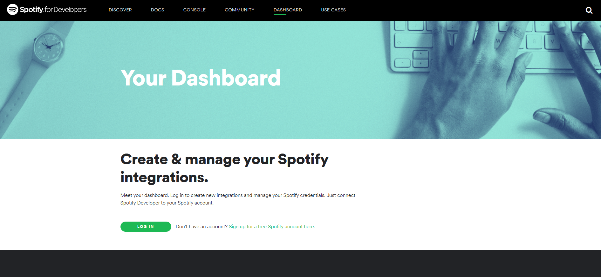

## Minhas músicas no spotify

Fala galera, para começo de conversa eu vim aqui pq estava pensando sobre as musicas que eu estava ouvindo e percebi que estou escutando cada vez mais as mesmas. Mas isso poderia ser só uma impressão minha, então quis tirar a prova e vi esse pacote maravilhoso que me da acesso as quais musicas eu tenho ouvido ultimamente o `spotifyr` :)

Então para instalar o spotifyr é só você usar o comando abaixo: 

```{r, echo=F, warning=F, message=F}

install.packages('pacman', repos ="https://cloud.r-project.org" )
pacman::p_load(
tidyverse,
lubridate,
rpart,
circlize,
dendextend,
ape,
devtools,
factoextra
)
devtools::install_github('charlie86/spotifyr') # dev version
devtools::install_github("hadley/emo") # emoji
library(spotifyr)
library(emo)
```


```{r, eval=FALSE}
install.packages("spotifyr") ##  stable version
devtools::install_github('charlie86/spotifyr') # dev version


# because we can
devtools::install_github("hadley/emo") # emoji
```


Antes de tudo precisamos ter uma chave da API para acessar os dados do Spotify. Para isso, faça login no seu painel na página "[Spotify for Developers](https://developer.spotify.com/dashboard/)".



Selecione "Create a Client ID" e preencha as perguntas necessárias. Isso o levará a uma página que mostra seu ID do cliente e segredo do cliente.

Depois de feito isso, voltamos para o R 

```{r, echo=FALSE}
Sys.setenv(SPOTIFY_CLIENT_ID = '980c973107584f84b3af8686d48a83e9')
Sys.setenv(SPOTIFY_CLIENT_SECRET = '66c4e1e0d12b434badffe72d72a1310c')
```

```{r, eval=FALSE}
id <- "Client ID"
secret <- "Client Secret"
Sys.setenv(SPOTIFY_CLIENT_ID = id)
Sys.setenv(SPOTIFY_CLIENT_SECRET = secret)
access_token <- get_spotify_access_token()
```


```{r, message=F, warning=F}

access_token <- get_spotify_access_token()
artist <- get_artist_audio_features('anitta')

artist %>%  
  glimpse()

```


### Análise de componentes principais

Quando temos muitas variáveis, é razoavel supor que elas variam em conjunto, esse é o fenomeno que chamamos de covariação. A análise de componentes principais (PCA) é uma técnica para descobrir o modo como as variáveis numéricas covariam. `r emo::ji("smile")``r emo::ji("smile")``r emo::ji("smile")`

Mas o que chamamos de **Componente principal**? 
 - A componente principal nada mais é que uma combinação linear das nossas variaveis.
 
 A idéia por trás é que, quando combinamos de forma linear as váriaveis, podemos ter um conjunto menor de variáveis do que o conjunto original e mesmo assim conseguimos "explicar" a maior parte da variabilidade dos dados originais,
 
 Vamos agora para um exemplo `r emo::ji("v")``r emo::ji("v")``r emo::ji("sing")`
 
 Para os nossos exemplos vamos usar dados retirados do *Spotify* `r emo::ji("music")` `r emo::ji("music")``r emo::ji("music")`
 
```{r, echo = FALSE, message=FALSE}


Sys.setenv(SPOTIFY_CLIENT_ID = '980c973107584f84b3af8686d48a83e9')
Sys.setenv(SPOTIFY_CLIENT_SECRET = '66c4e1e0d12b434badffe72d72a1310c')


```
 
```{r, message=FALSE, warning=FALSE}
artists <- "marilia mendonca"
album_data <- spotifyr::get_artist_audio_features(artists,dedupe_albums = TRUE)
glimpse(album_data)
```


`r emo::ji("cry")` `r emo::ji("cry")` `r emo::ji("cry")` `r emo::ji("cry")` `r emo::ji("cry")` `r emo::ji("cry")` `r emo::ji("cry")`

Podemos ver que temos muitas variáveis que são retornadas pela API do *Spotify*, mas para o nosso exemplo, temos que pegar apenas as numéricas. 

[Descrição das variaveis](https://developer.spotify.com/documentation/web-api/reference/tracks/get-audio-analysis/)

```{r}
album_data_filter <- album_data %>% select(danceability, energy, loudness, speechiness, acousticness, instrumentalness, liveness, valence)

album_data_filter %>% glimpse()
```

Agora que temos nossas variáveis numéricas podemos aplicar o **PCA**

```{r}

pca <- princomp(album_data_filter,cor = T, scores = T)
# screeplot(pca, )
fviz_eig(pca)

```
```{r}
fviz_pca_biplot(pca, repel = TRUE,
                col.var = "#2E9FDF", # Variables color
                col.ind = "#696969"  # Individuals color
                )
```

Vamos investigar um pouco os pesos das componentes, para isso vamos criar um plot com as cargas. Mas vamos nos ater apenas as 4 primeiras.

```{r}
loadings <- as_data_frame(pca$loadings[,1:4])
loadings$Symbol <- row.names(pca$loadings)
loadings <- tidyr::gather(loadings, "Component", "Weights", -Symbol)

ggplot(loadings, aes(x = Symbol, y = Weights)) + 
  geom_bar(stat = "identity") +
  facet_grid(Component ~ .)
```

- As componentes são criadas de forma a minimizar a correlação, evitando assim redundancias. 
- Podemos escolher a quantidade de componentes a partir de um threshold da variância explicada. 
- Podemos também investigar as cargas(pesos) das componentes para saber quais componentes tem uma explicação mais intuitiva. 

### Agrupamento pelo método K-means

O agrupamento é uma tecnica para dividir os dados em diferentes grupos na qual as observações são semelhantes umas as outras.

```{r, eval=F}
playlist_uri <- get_my_playlists() %>% filter(name == "Festa na Piscina") %>% select(uri) %>% pull()

playlist_featured <- get_playlist_audio_features(username = "12166616731", str_split(playlist_uri, ":")[[1]][3])
```

```{r, echo=F}
playlist_featured <- get_playlist_audio_features(username = "12166616731","37i9dQZF1DXdWpx7KRCSbJ")

playlist_featured %>% glimpse()
```

```{r}
playlist_featured_filtered <- playlist_featured %>% select(danceability, energy, loudness, speechiness, acousticness, instrumentalness, liveness, valence)
```

```{r}
pct_var <- data_frame(pct_var = 0, num_clusters = 1:8)

for (i in 1:8) {
  # print(i)
  pct_var[i-1, 'pct_var'] <- kmeans(playlist_featured_filtered, centers = i, iter.max = 50)$tot.withinss
}

```
```{r}
plot(pct_var$num_clusters, pct_var$pct_var,
       type="b", pch = 19, frame = FALSE, 
       xlab="Number of clusters K",
       ylab="Total within-clusters sum of squares",
       col = "dodgerblue")
```

```{r}
totalss <- kmeans(playlist_featured_filtered, centers = 4, iter.max = 50)
totalss
```

```{r}
playlist_featured$cluster <- totalss$cluster

musics <- playlist_featured %>% group_by(cluster) %>% select(track.id) %>% slice(1)
music_cluster <- glue::glue("https://open.spotify.com/embed/track/{musics$track.id}")

```

### Cluster 1

<iframe src="`r music_cluster[1]`" width="300" height="80" frameborder="0" allowtransparency="true" allow="encrypted-media"></iframe>

### Cluster 2

<iframe src="`r music_cluster[2]`" width="300" height="80" frameborder="0" allowtransparency="true" allow="encrypted-media"></iframe>

### Cluster 3

<iframe src="`r music_cluster[3]`" width="300" height="80" frameborder="0" allowtransparency="true" allow="encrypted-media"></iframe>

### Cluster 4

<iframe src="`r music_cluster[4]`" width="300" height="80" frameborder="0" allowtransparency="true" allow="encrypted-media"></iframe>


### Agrupamento Hieraquico


```{r}
artists <- "sandy e junior"
album_data <- spotifyr::get_artist_audio_features(artists,dedupe_albums = TRUE)
```

```{r}
album_data_summarise <- album_data %>% 
  select_if(is.numeric) %>% 
  bind_cols(album_data %>% select(album_name)) %>% 
  group_by(album_name) %>% 
  left_join(album_data %>% select(album_name, album_release_year)) %>% 
  summarise_if(is.numeric, mean, na.rm = TRUE) %>% 
  ungroup() 

album_data_summarise <- album_data_summarise %>% 
  ungroup() %>% 
  mutate(album_name = paste(album_data_summarise$album_name, album_data_summarise$album_release_year, sep = " - ")) %>% 
  column_to_rownames("album_name") %>% 
  select(-c(album_release_year, time_signature  
            ,disc_number     
            , duration_ms      
            , track_number)) %>% 
  as.data.frame()
```

```{r, eval=T }
top_dend <- as.dendrogram(hclust(dist(album_data_summarise)))

plot(as.phylo(top_dend), type = "fan", cex = 0.6,
     no.margin = TRUE)
```

